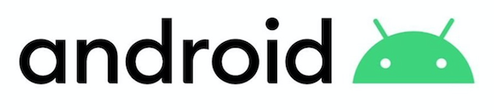
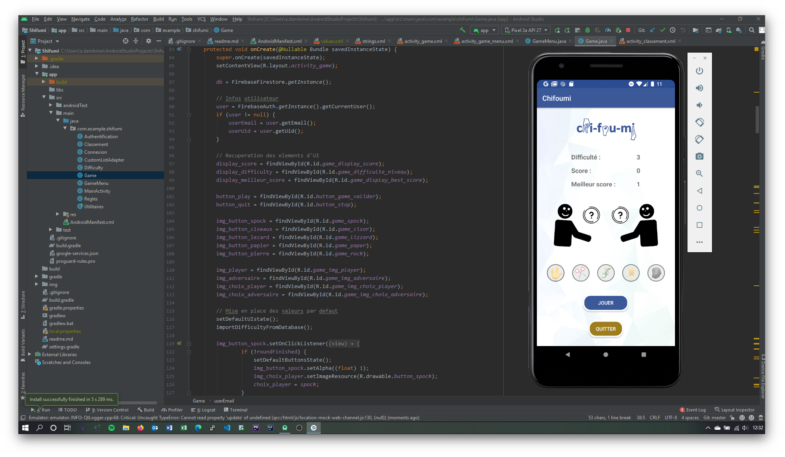
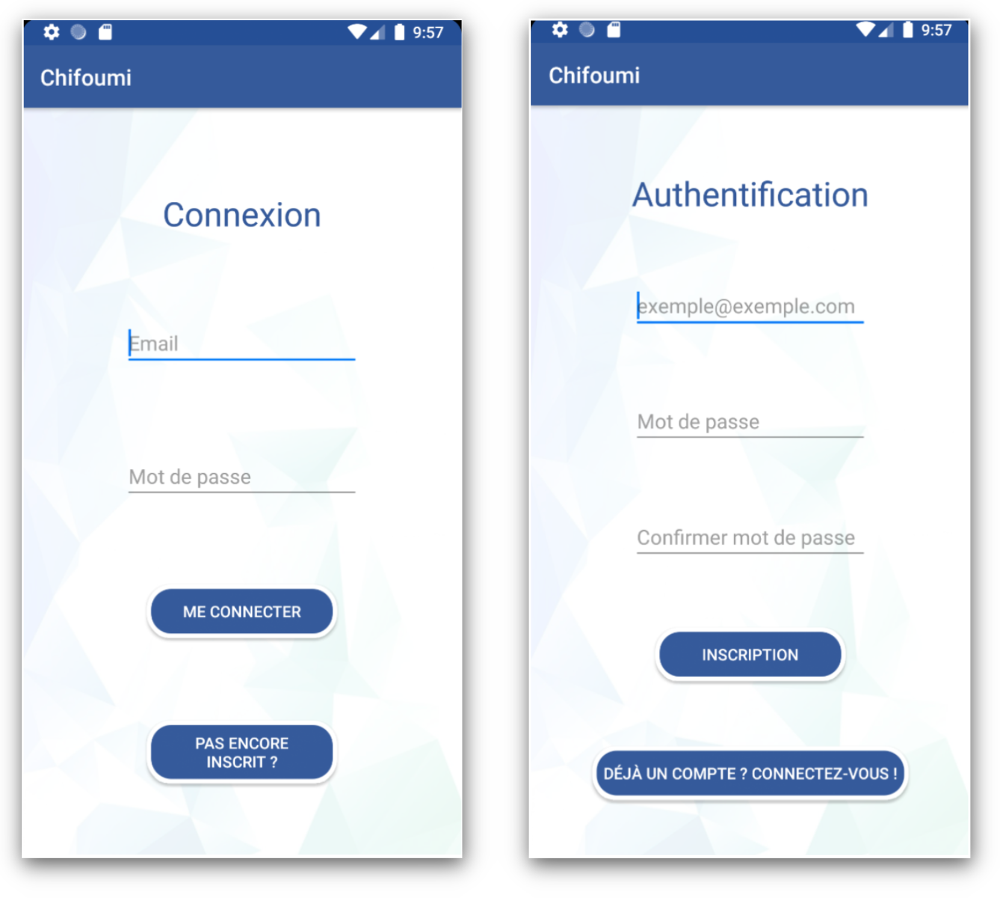
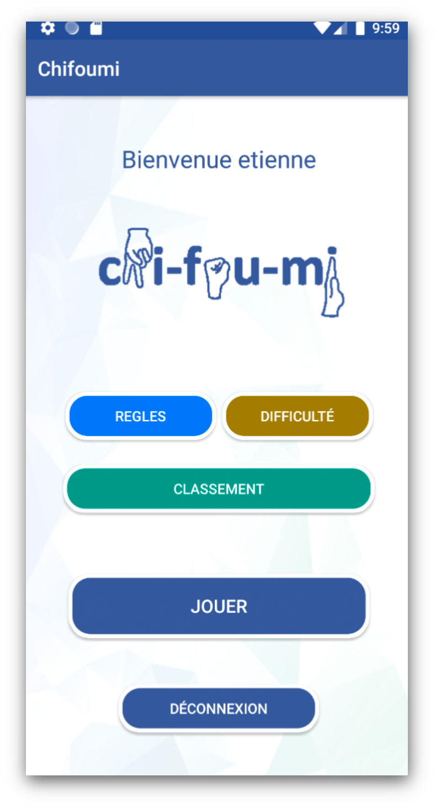
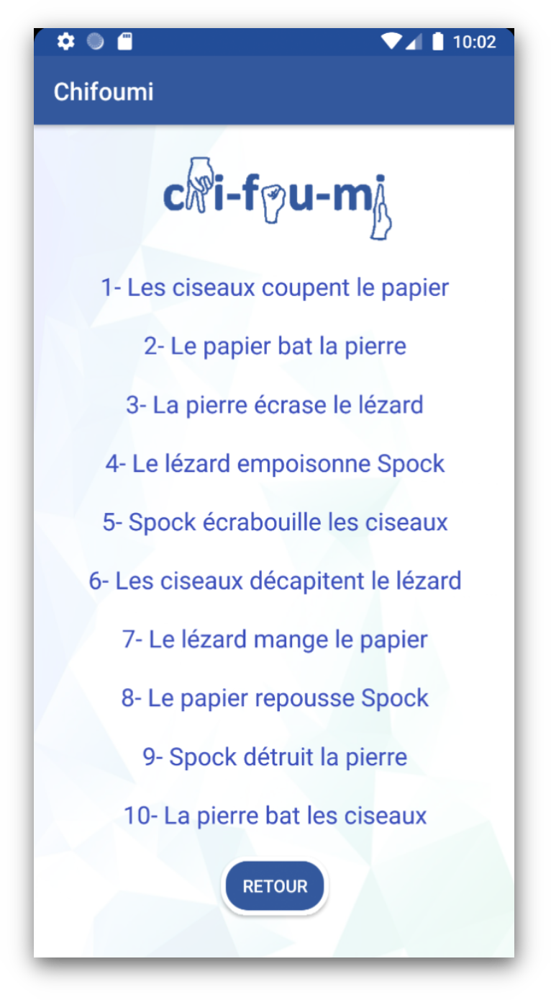
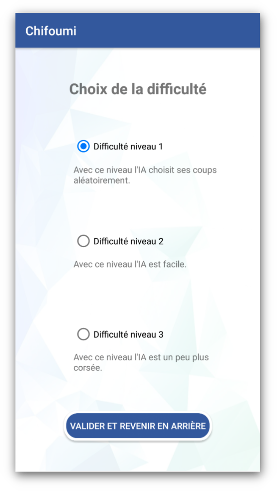
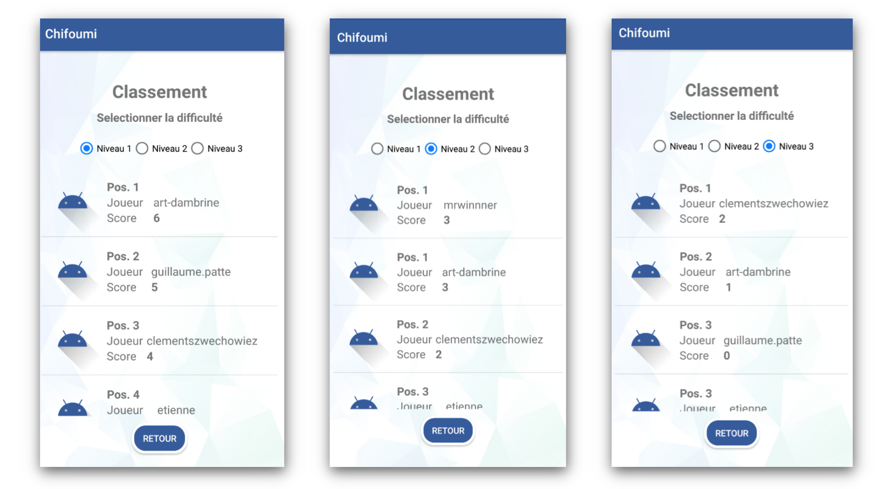
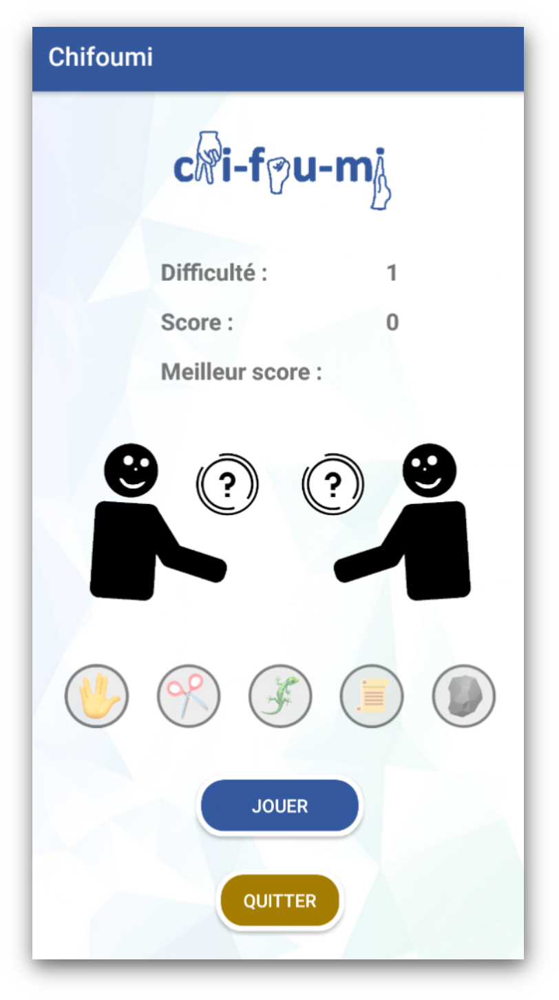
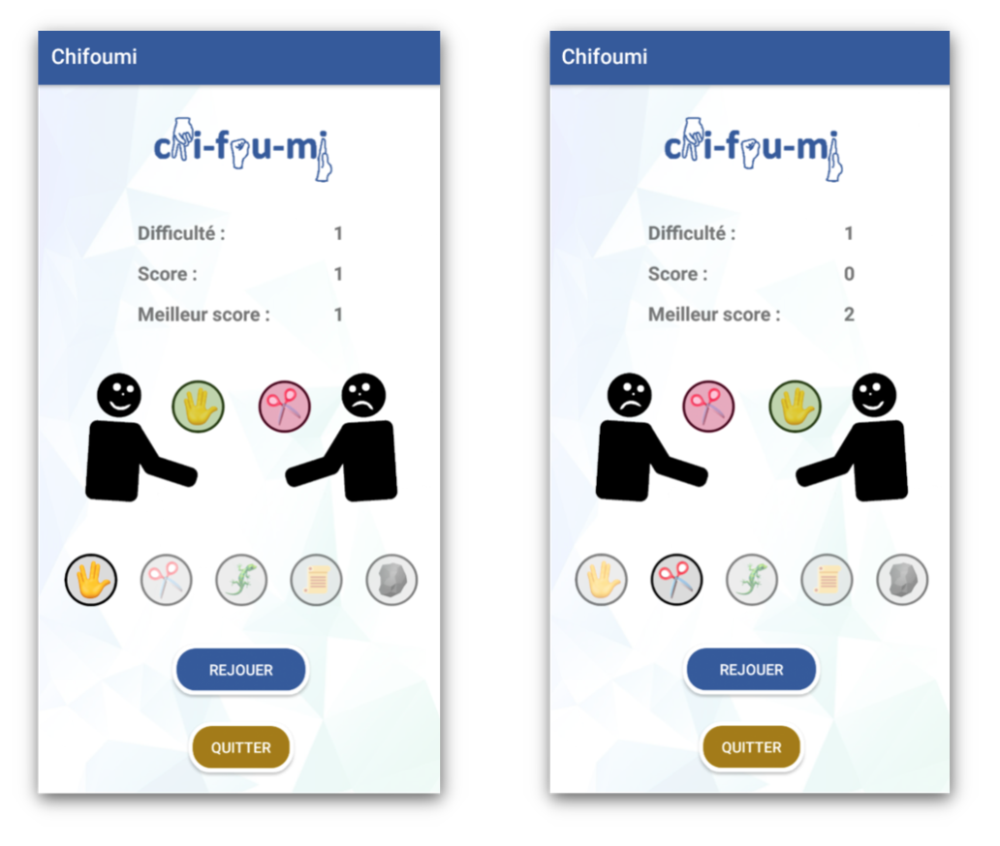
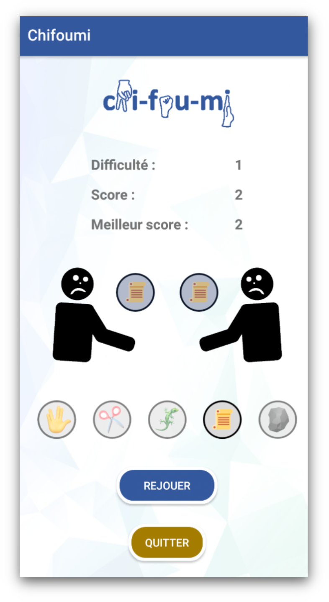

  

# Projet - Jeu du Chifoumi 

L'application est disponible au format .apk : https://art-dambrine.ovh/public-doc/chifoumi.apk

   
   **Sommaire**

- [Introduction - sujet](#introduction---sujet)
- [Contraintes](#contraintes)
- [Le jeu du chifoumi](#le-jeu-du-chifoumi)
    
    - [Exemple de partie](#exemple-de-partie)
    

## Introduction - sujet

Nous développerons une application Android dans le but de recréer le jeu du chifoumi étendu (5 coups possibles). L'application sera développée en langage Java avec Android Studio. Nous avons faiy le choix d'utiliser le système d'authentification et de stockage de Firebase proposé par la société Google.

Nous utilisons pour ce projet l'IDE Android Studio developpé par Jetbrains.

## Contraintes

Pour le jeu nous avons différentes contraintes à respecter. 

**Premièrement** nous devons **authentifier l’utilisateur** pour comptabiliser ses résultats et créer un classement avec nos différents utilisateurs inscrits. Pour cela nous utilisons la base de données dans le Cloud Firebase. L’utilisateur est amené à se connecter, ou à s’inscrire si c’est sa première connexion.

  

Une fois l’utilisateur authentifié il arrivé sur sa page d’accueil. Cette page reprend les éléments principaux du jeu, en soi : les **règles**, le **choix du niveau de difficulté**, le **classement des joueurs**, la possibilité de **lancer le jeu** et la possibilité de se déconnecter de son compte.

  

La **seconde contrainte** mise en place est les **différentes situations de jeu**. C’est-à-dire les règles. Ici nous avons ajouté toutes les règles que le joueur doit connaitre pour joueur au jeu. Quand il cliquera ensuite sur joueur, il sera face à une intelligence qui fera des choix en fonction du niveau de difficulté sélectionné.

La **troisième contrainte** mises en place est un système de **gestion de la difficulté du jeu**. Nous l’avons ventilé en trois niveaux de difficulté : 

- Niveau 1 : ce mode est aléatoire, il n’intègre pas un niveau spécifique ;
- Niveau 2 : ce mode est simple, les choix de l’IA permettront à l’utilisateur de gagner majoritairement ;
- Niveau 3 : ce mode est plus difficile, les choix de l’IA rendront le jeu plus compliqué et donc l’utilisateur gagnera moins.

  

La **quatrième contrainte** est de réaliser un **système de classement**. Ici nous avons choisi de ventiler ce classement en fonction du niveau de jeu sélectionné précédemment. La page permet de choisir le niveau, et nous retrouvons nos utilisateurs avec leur position et score réalisé dans ce mode de difficulté. Les joueurs ayant le même score sont indiqués exæquo avec le même numéro de position.

  

La **cinquième et dernière contrainte** est la **déconnexion de l’utilisateur**. Quand celui-ci clique sur le bouton de déconnexion quitte l'activité en cours et est invité à se reconnecter. Une fois déconnecté l’utilisateur n’a plus accès au jeu, ni au classement.

## Le jeu du chifoumi

Une fois que nous avons choisi notre niveau de difficulté nous pouvons entrer dans le jeu. Celui-ci se présente comme suit :

- Nous retrouvons notre niveau de difficulté sélectionné précédemment, ici 1 (jeu aléatoire).

- Notre score est indiqué, pour l’instant 0 car nous n’avons pas encore joué (et gagné).

- Le meilleur score de la partie est aussi rappelé. 

- Nous retrouvons ensuite les deux joueurs, à gauche notre utilisateur ; à droite l’IA. Chaque joueur dispose d’une petite vignette qui montre le choix de chacun des joueurs. En dessous, les différentes possibilités sont indiqués ; le joueur n’a qu’à sélectionner et cliquer sur joueur.

  

### Exemple de partie

Sur la première capture, nous gagnons. **Notre score est mis à jour ainsi que le meilleur score**. Nous cliquons sur rejouer. J’ai de nouveau gagné (pas de capture), mon score est passé à 2. J’ai ensuite rejoué (capture 2), mon meilleur score est à 2 mais mon score est tombé à 0 car j’ai perdu.

  

**Egalité** entre les joueurs. Le jeu est déclaré « nul » quand les deux joueurs ont sélectionné le même élément. **Le score est donc maintenu.**

  

**Le jeu fonctionne de la même manière dans les divers niveaux de difficulté** qui viendroit impacter le nombre de victoires consécutives qu’un utilisateur pourra espérer atteindre.

